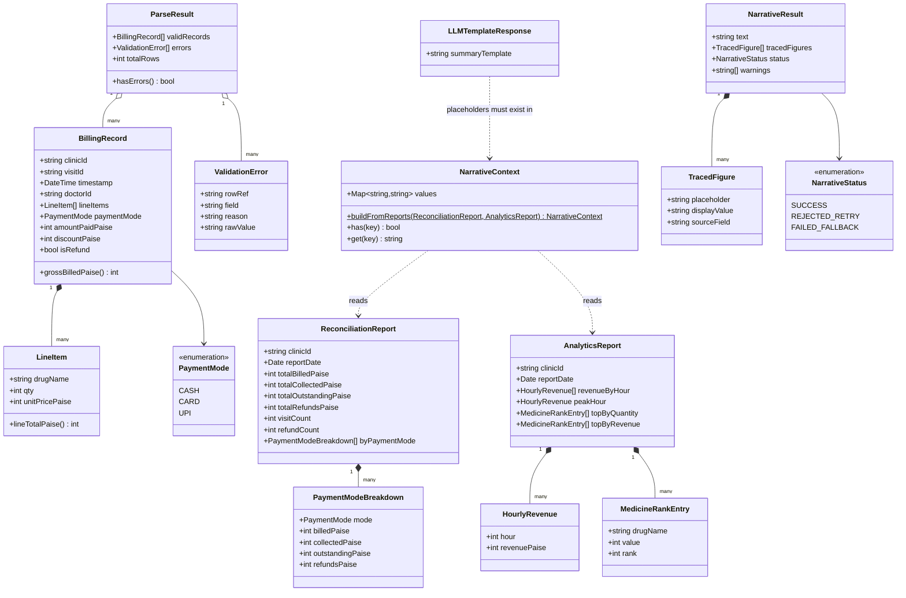
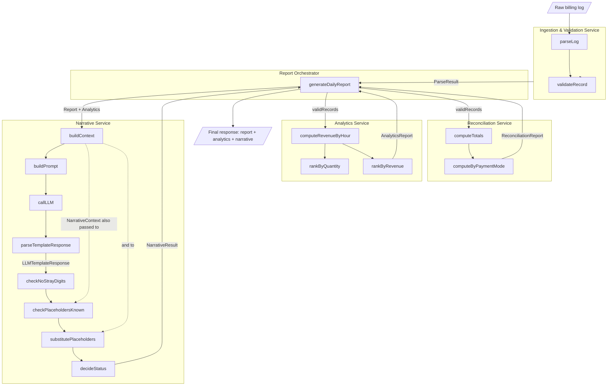
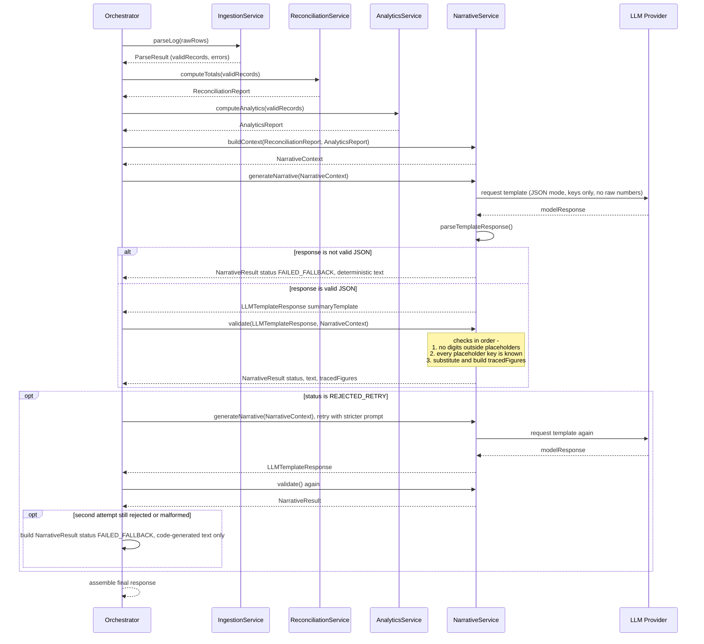
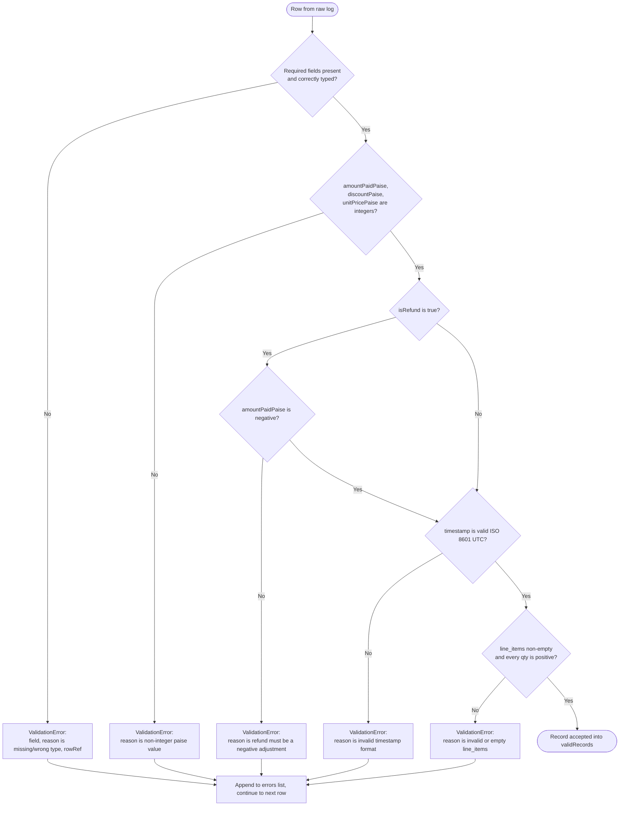
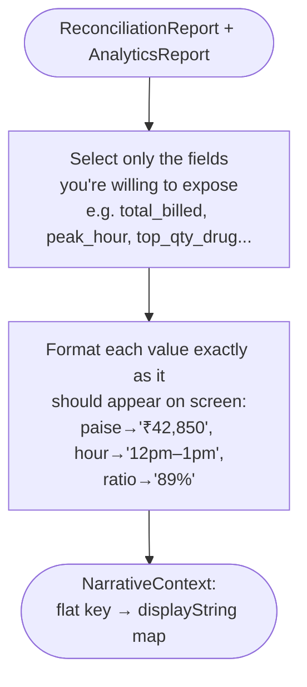
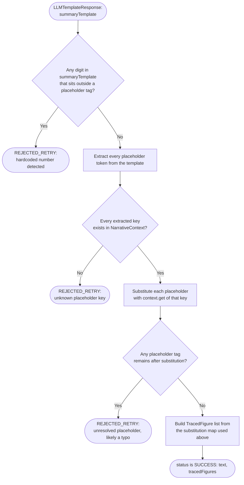

# EOD Billing & Analytics Agent — Core Services LLD

Scope: the deterministic reconciliation layer, analytics layer, and LLM narrative + grounding
layer. REST transport and frontend are intentionally out of scope here — these services should
be pure, framework-agnostic modules that any API layer (Node/Express, Python/FastAPI, etc.) can
call.

---

## 1. Data Models



**Design notes**
- `amountPaidPaise`, `unitPricePaise`, `discountPaise` are always `int` — never float, per the
  brief. Enforce this at the model boundary (reject non-integer input rather than rounding).
- `isRefund = true` records carry a negative `amountPaidPaise` — model this as a signed integer,
  not a separate refund object, so summation stays simple and auditable.
- `ParseResult` deliberately separates `validRecords` from `errors` instead of throwing on first
  bad row — the brief wants *all* malformed rows reported, not a fail-fast 500.
- `NarrativeContext` is the **only** thing the LLM ever sees, and the **only** vocabulary it's
  allowed to reference. It's a flat, pre-formatted `key → displayString` map built directly from
  the two report objects (e.g. `"total_billed" → "₹42,850"`). The LLM never receives raw paise
  integers and never writes a number itself — it only writes `{{total_billed}}` and your code
  substitutes the value. This makes grounding structural rather than detected-after-the-fact.

---

## 2. Service Boundaries



**Why this split**
- **Ingestion**, **Reconciliation**, **Analytics** never import anything LLM-related — they must
  be independently unit-testable and independently *correct*, since the brief grades this layer
  first and treats it as ground truth for everything downstream.
- **Narrative**, **Context Building**, and **Grounding** have been consolidated into a single `NarrativeService` class to reduce file overhead. The grounding logic itself still never talks to the model — it remains as pure string/dict operations (`_check_no_stray_digits`, `_check_placeholders_known`, `_substitute_placeholders`) that are fully unit-testable with hand-written fake LLM template responses.
- **Orchestrator** is the only piece that knows the full pipeline order. It owns retries and the
  fallback decision — services below it stay dumb and single-purpose.

---

## 3. Sequence — End-to-End Report Generation



**What changed from a naive "ask LLM for a summary" approach**
- The LLM never receives raw report objects or paise values — only a pre-formatted, whitelisted
  `NarrativeContext`. It structurally cannot reference a field you didn't expose (e.g. profit),
  and it has no channel to talk about anything outside that list at all — not even to name it.
- The LLM never writes a number in the output text at all — it writes `{{placeholder}}` tokens.
  Your code performs the only substitution, using values it already trusts.
- `LLMTemplateResponse` is now a single field (`summaryTemplate`). There's no
  self-reported "here's what I couldn't compute" channel — that removes a second surface the
  model could misuse (e.g. inventing a plausible-sounding reason, or listing a metric that
  *is* available as unavailable). Any fixed disclaimer (like the profit note) is appended by
  your own code, unconditionally, not authored or triggered by the model at all.
- Grounding becomes **pure validation of the template + context lookup**, not fuzzy text mining.
  `checkNoStrayDigits` and `checkPlaceholdersKnown` are both simple, deterministic, and trivial
  to unit test with hand-crafted "bad" LLM responses — no network calls needed.
- `TracedFigure[]` (used to render the "Traced Figures" panel) falls out of the substitution
  step for free — it's literally the map of `{{key}} → displayValue → sourceField` you just used,
  not a separately reconstructed match.

---

## 4. Flow — Validation (specific, actionable errors)



Key rule: **one bad row never aborts the batch.** `parseLog` always returns both
`validRecords` and `errors` — the API layer decides whether "some errors" is a 207-style partial
response or a 422, but the ingestion service itself never throws.

---

## 5. Flow — Grounding by Construction (Template + Placeholder Substitution)

This is the piece that gets auto-graded. Instead of letting the LLM write numbers and then
detecting/matching them after the fact, the LLM is only ever allowed to write **references** to
a whitelisted, pre-formatted context. Grounding becomes validation of structure, not text mining.

**Step A — Build the whitelist context (runs before the LLM call)**



**Step B — Validate the LLM's template response (runs after the LLM call)**



**Implementation notes**
- Step A runs once per report generation, independent of the LLM — it's pure formatting logic
  and fully unit-testable without any model involved (assert `context.get("total_billed") ==
  "₹42,850"` given a known report).
- `checkNoStrayDigits` is a single regex: strip all `{{...}}` spans out of the template first,
  then check whether any `\d` remains in what's left. This one check does most of the grounding
  enforcement work that used to require fuzzy number-matching.
- Because the LLM only ever sees context *keys* (e.g. `total_billed`, `peak_hour`,
  `top_qty_drug`), a metric like `profit` — which was never added to the context because cost
  price isn't in the schema — cannot be referenced, computed, or hallucinated as a placeholder.
  There is no LLM-facing field for it to report unavailability through anymore either.
- The "say so plainly if not computable" requirement is satisfied entirely in code, not by the
  model: your `context_builder` maintains a small static list of known-unavailable metrics for
  this domain (e.g. profit, since cost price is never in the schema) and your
  `narrative_service` appends a fixed, pre-written, non-LLM sentence to the final text whenever
  that condition applies — e.g. *"Note: cost data wasn't available today, so this is revenue,
  not profit."* This sentence is identical every time and ships as a constant, so it needs zero
  grounding validation of its own.
- On second retry failure, fall back to a fully code-generated narrative (string formatting only,
  zero LLM text) — guarantees the "never crash / never corrupt" requirement regardless of how the
  model misbehaves.
- When retrying, feed the specific rejection reason back into the prompt (e.g. "you wrote the
  literal number 8400 — use {{peak_hour_revenue}} instead") rather than just repeating the
  original prompt — this meaningfully improves second-attempt success rates.

---

## 6. Suggested Module Layout (language-agnostic)

```
core/
  models/
    billing_record.*
    reconciliation_report.*
    analytics_report.*
    narrative_result.*
  ingestion/
    parser.*
    validator.*
  reconciliation/
    reconciliation_service.*
  analytics/
    analytics_service.*
  narrative/
    narrative_service.*    # Single class containing Context Builder, LLM orchestration, and Grounding logic
  orchestrator/
    report_orchestrator.*
tests/
  fixtures/
    sample_day_happy_path.json
    sample_day_edge_cases.json         # malformed rows, refunds, zero discount
    llm_response_clean_template.json   # well-formed {{placeholder}} response
    llm_response_stray_digit.json      # model wrote a literal number
    llm_response_unknown_key.json      # model invented/hallucinated a placeholder
                                        # e.g. {{profit}} or {{yesterday_revenue}}
    llm_response_malformed_json.json   # not valid JSON at all
  ingestion.test.*
  reconciliation.test.*
  analytics.test.*
  context_builder.test.*
  grounding.test.*
```

Keep the grounding methods within `NarrativeService` testable with zero network calls — they should take an
`LLMTemplateResponse` + a `NarrativeContext` and return a `NarrativeResult`. That lets you write
tests like "feed it a template containing the literal `8400`, assert `status ==
REJECTED_RETRY`" or "feed it `{{profit}}`, assert rejection with reason 'unknown placeholder'" —
all without ever calling the LLM API, which is exactly the scenario they said they grade
automatically.
